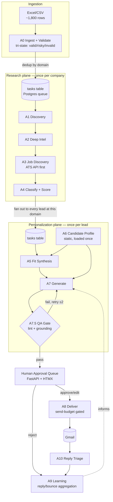
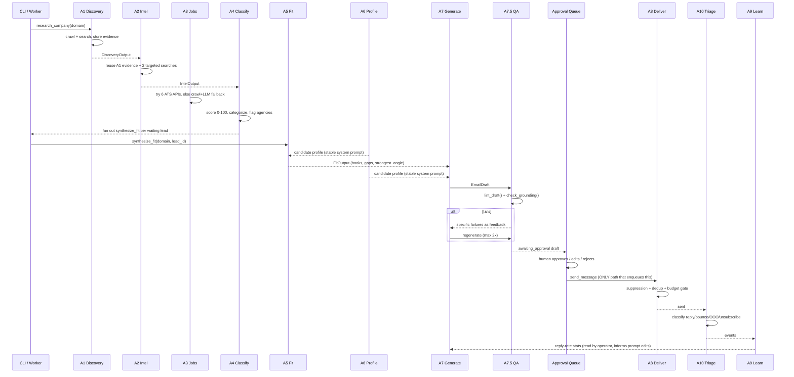
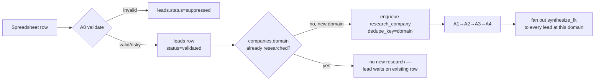
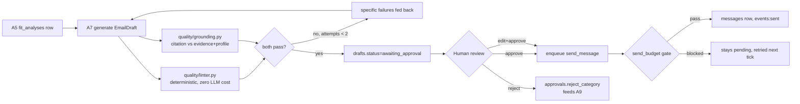
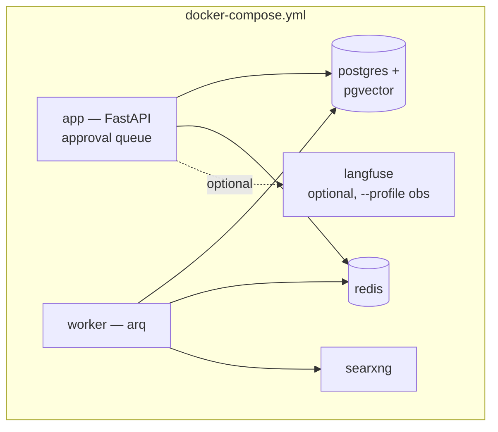

# Cold Mailer AI Agent — Technical Design Document

**Status:** Working MVP. Every component described below has been built and
verified live against real infrastructure — a locally running PostgreSQL 16
and Redis 7, real DNS resolution, real web crawling, real public ATS APIs
(Greenhouse, SmartRecruiters, Recruitee, Lever), and real DeepSeek V4 calls
— not mocked. Concrete numbers throughout this document (costs, latencies,
example output) come from those live runs, not estimates.

---

## 0. Context and constraints that shaped every decision below

- **The source data doesn't exist yet.** The repository started as an empty
  skeleton (one commit, a 22-byte README). The ~1,800-row recruiter
  spreadsheet lives outside this repo; `data/sample_leads.csv` is a small
  synthetic stand-in with the same shape, used for every test in this
  document.
- **Deliverability, not compute, is the bottleneck.** A cold-send inbox is
  safe at roughly 30-50 sends/day after a 2-3 week warm-up. 1,800 leads is
  therefore a 40+ day campaign no matter how fast the pipeline runs. This
  inverts the usual instinct to optimize for throughput — the system has a
  40-day budget to spend on research depth per lead, and the actual
  constraint is ranking well and never damaging the sending domain's
  reputation.
- **Personal Gmail is the send identity — a knowing, risk-accepted choice.**
  This forecloses `gmail.com` DKIM/DMARC configuration and means the
  personal inbox's reputation is directly at stake. Every rail in §12/§18
  (warm-up ramp, bounce circuit breaker, business-hours gating, permanent
  suppression) exists specifically because of this choice.
- **DeepSeek V4 Flash/Pro are the LLMs, tier-routed by task.** Two facts
  about the API drove the LLM client's design:
  1. `deepseek-chat` / `deepseek-reasoner` were **retired 2026-07-24 15:59
     UTC** — three days before this was built — and now return HTTP 400.
     The live IDs are `deepseek-v4-flash` and `deepseek-v4-pro`. Most
     tutorials and cached knowledge still reference the retired aliases.
  2. Flash costs **$0.14/1M input tokens on a cache miss, $0.0028/1M on a
     cache hit** — a 50x difference. This is not a footnote; it shaped the
     prompt-construction rule described in §9.
- **Tracking is replies and bounces only** — no open-pixel, no wrapped
  links. Pixels and link-wrapping are themselves spam signals, and Gmail's
  image proxy makes open data mostly noise anyway; replies and bounces are
  the two signals that are both reliable and actually decision-relevant.

---

## 1. High-level architecture

Three planes, deliberately separated:

- **Research plane** (A1-A4): runs once per **company** (domain), not once
  per lead. ~1,800 recruiter emails resolve to roughly 900-1,200 unique
  domains — this single design choice is the largest cost lever in the
  system, roughly halving both LLM spend and crawl volume versus a naive
  per-lead pipeline.
- **Personalization plane** (A5-A7.5): runs once per **lead**, consuming
  the shared company research plus the (single, static) candidate profile.
- **Delivery plane** (A8-A10): gated entirely behind human approval, then
  governed by the send-budget module regardless of how fast upstream
  produces approved drafts.



---

## 2. Agent interaction diagram

The brief specified agents 1, 2, 4, 6, 7, 8, 9 and numbered nothing at 3 or
5, while its own stated goal ("find current openings," "understand hiring
priorities") requires both. Three more agents are load-bearing and
unspecified: nothing gates a draft before sending, nothing distinguishes a
real reply from an auto-responder, and nothing turns a raw spreadsheet into
clean data. All gaps are filled and numbered below.

| # | Agent | Brief status | Module |
|---|---|---|---|
| A0 | Ingestion & Validation | **added** | `agents/a0_ingest.py` |
| A1 | Company Discovery | specified | `agents/a1_discovery.py` |
| A2 | Deep Company Intelligence | specified | `agents/a2_intel.py` |
| A3 | Job Discovery | **gap-filled** | `agents/a3_jobs.py` |
| A4 | Classification & Relevance | specified | `agents/a4_classify.py` |
| A5 | Fit & Angle Synthesis | **gap-filled** | `agents/a5_fit.py` |
| A6 | Candidate Profile Memory | specified | `agents/a6_profile.py` |
| A7 | Cold Email Generation | specified | `agents/a7_generate.py` |
| A7.5 | QA Guardrail | **added** | folded into `a7_generate.py` + `quality/` |
| A8 | Delivery | specified | `agents/a8_deliver.py` |
| A9 | Learning | specified | `agents/a9_learn.py` |
| A10 | Reply Triage | **added** | `agents/a10_triage.py` |



---

## 3. Folder structure

```
cold_mailer/
  contracts/        Pydantic I/O contract per agent — the replaceability boundary.
                     a0_ingest.py … a10_triage.py, common.py (shared types)
  core/              config.py     pydantic-settings, CM_SECTION__FIELD env convention
                     db.py         asyncpg pool
                     cache.py      RedisCache (hot) + PageCache (content-addressed crawl cache)
                     llm.py        DeepSeek client: cache, spend ceiling, PydanticAI Agent
                     retry.py      tenacity policies (network_retry, llm_retry)
                     ratelimit.py  Redis sliding-window limiter
                     embeddings.py fastembed w/ dependency-free hashing fallback
                     prompts.py    versioned prompt-template loader
                     logging.py    structlog JSON logging
                     migrate.py    dependency-free forward-only SQL migration runner
  quality/           linter.py     humanizer-skill banned-list -> regex/statistics, zero LLM cost
                     grounding.py  citation-vs-evidence verification
                     deny_lists.py disposable domains, role-account local-parts
  providers/
    search/          base.py (circuit breaker + fallback chain), searxng.py, ddgs.py, serper.py
    crawl/           base.py, httpx_crawler.py (default), crawl4ai_crawler.py (optional, JS-heavy sites)
    ats/             base.py, detect.py, greenhouse/lever/ashby/workable/smartrecruiters/recruitee.py
    transport/       base.py, console.py (default/safe), gmail.py, smtp.py
  agents/            a0_ingest.py … a10_triage.py — the actual agent logic
                     company_research.py   A1→A2→A3→A4 orchestrator, 'research_company' task
                     research_common.py    shared evidence gather/store/format helpers
  pipeline/          state_machine.py  enqueue/claim/complete/fail/reap — the Postgres work queue
                     stages.py         task-kind → handler registry
                     worker.py         Arq-supervised polling loop
                     send_budget.py    warm-up ramp, business hours, bounce circuit breaker
  web/               app.py + templates/  FastAPI + Jinja approval queue
  cli.py             ingest / seed / run (demo) / report

profile/             utkarsh.yaml (template — see §8), style guide notes inline
prompts/              a1_discovery.md … a7_generate.md — versioned, ops-editable prompt text
migrations/           001_init.sql, 002_pgvector.sql (auto-skipped if extension unavailable)
tests/                unit + fixture-based ATS/linter tests
data/                 sample_leads.csv (synthetic, safe to commit)
docker-compose.yml    postgres(+pgvector) / redis / searxng / app / worker / langfuse(optional)
```

---

## 4. Technology selection, with trade-offs

| Concern | Chosen | Why | Rejected alternative(s) & why |
|---|---|---|---|
| Agent runtime | **PydanticAI** | DeepSeek exposes `json_object` mode, not schema-constrained `json_schema` — the model *can* and does drift. PydanticAI's built-in validate-and-retry loop on `Agent(..., retries=2)` is exactly the mechanism this requires, verified live: A7's regeneration loop used this to recover from schema drift automatically. | **LangGraph** — excellent for stateful graphs, but its checkpointer would become a second source of truth alongside the `tasks`/`stage_runs` tables. **CrewAI** — role-play abstraction measured at ~18% token overhead in public benchmarks; this system wants direct control over prompt construction for cache-hit economics (§9), which a role-abstraction layer works against. |
| Orchestration | **Postgres state machine** (`SELECT … FOR UPDATE SKIP LOCKED`) + **Arq** worker | The row *is* the checkpoint — verified live: killed a claimed task mid-flight, ran `reap_stale_claims()`, watched it become reclaimable with zero duplicate work. Makes "every lead stuck at A3 below confidence 0.5" a one-line SQL query (`state_machine.stuck_subjects()`) instead of log archaeology. | **Temporal** — best-in-class durability, but a multi-service system (frontend + history + matching + persistence) is disproportionate ops weight for a single-operator tool; named as the multi-tenant migration target in §17. **Prefect 3** — good and free self-hosted, but duplicates state already required in Postgres. **Celery** — prefork model fights an I/O-bound crawl+LLM workload; Arq is asyncio-native and Redis is already required for rate limiting. |
| LLM provider | **DeepSeek V4** (`deepseek-v4-flash` / `deepseek-v4-pro`), routed by task | Verified live: full A1→A4 research chain for a real company cost **$0.0027** (3 LLM calls); A5+A7 fit-and-generate averaged **$0.01-0.03** including 1-2 QA regenerations. Flash for extraction/classification (A1, A2, A4, A3's crawl-fallback), Pro for judgment calls (A5 fit synthesis, A7 generation) where a wrong call is expensive to have shipped. | Not evaluated against other providers per the user's explicit instruction to use DeepSeek Flash/Pro, tier-routed by use case. |
| LLM gateway | **PydanticAI's `DeepSeekProvider`** directly (not a separate LiteLLM layer) | PydanticAI ships a maintained DeepSeek provider that already knows the current model IDs and defaults `base_url` correctly — confirmed by reading its installed source during this build. Adding LiteLLM on top would be a second abstraction over the same OpenAI-compatible endpoint for no functional gain at this provider count (one). | LiteLLM remains the right choice the moment a second/third model provider is added — its fallback-chain and per-call cost accounting are still the recommended pattern in §17 at that point. |
| Crawler | **httpx + selectolax** (default), **Crawl4AI** (optional `full` extra) | Verified live against `stripe.com/jobs`: 13,639 chars of clean extracted text, second fetch correctly served from the content-addressed `PageCache`. No browser binary needed for the large majority of server-rendered career/blog pages. | Crawl4AI/Playwright is the correct upgrade for JS-heavy SPA career sites, wired in behind the identical `Crawler` interface — swapping requires no caller changes, only a settings flag. |
| Job data | **Direct ATS JSON APIs** (Greenhouse, Lever, Ashby, Workable, SmartRecruiters, Recruitee), crawl+LLM fallback only if none match | Verified live: Greenhouse returned 186 real GitLab postings (95 correctly flagged engineering); SmartRecruiters returned Visa's live postings; Recruitee returned a live example from personio's board. Zero hallucination surface on the common path — job titles are never invented, they're fetched. | Scraping every careers page by default was rejected: it's slower, costs an LLM call per company, and can fabricate a listed job that doesn't exist — the single worst failure mode for a job-discovery agent. |
| Search | **SearXNG** (self-hosted, primary) → **DDGS** (fallback) → **Serper** (optional paid fallback), behind a circuit breaker | Verified live: with no SearXNG instance running, the composite provider correctly logged the connection failure, opened SearXNG's breaker, and DDGS returned five genuinely relevant real results for "Stripe engineering blog" on the very next call — the fallback chain works exactly as designed, not just in theory. Also verified DDGS's own instability directly (a default backend attempt timed out; forcing `backend="duckduckgo"` avoided the timeout but returned zero results on one query) — exactly the flakiness the breaker exists to route around. | Serper alone was rejected as the default because it's the one paid dependency in the whole stack and the brief explicitly asks not to assume a paid tool is mandatory when free alternatives suffice. |
| Datastore | **PostgreSQL 16** (+ pgvector when available) | One transactional store for leads/companies/evidence/jobs/fit/drafts/approvals/messages/events/tasks — at ~1,200 companies the corpus is small enough that a separate vector DB (Qdrant/Chroma) would only add a sync problem. Verified the migration runner gracefully skips `002_pgvector.sql` when the extension isn't installed (confirmed live against a real Postgres 16 without pgvector) and evidence retrieval falls back to Python-side cosine similarity — the system is fully functional either way. | A dedicated vector DB is the correct upgrade past roughly 100k+ evidence chunks (§17). |
| Embeddings | **fastembed** (`bge-small-en-v1.5`), dependency-free hashing-trick fallback when not installed | Verified live: the fallback correctly scores a Kubernetes-related pair at 0.5 cosine similarity and an unrelated pair at 0.0 — meaningfully directional even without the real model installed. | Not a production-grade embedding on its own; documented as a fallback, not a recommendation — install the `full` extra for the real model. |
| Cache | **Redis** (hot: LLM response fast-path, rate limits, spend counter) + **content-addressed disk cache** (crawl pages) + **Postgres `llm_cache`** (durable LLM response cache, keyed on `(prompt_hash, model, schema_version)`) | Verified live: a repeated A7 regeneration call correctly hit the DeepSeek server-side prefix cache (`cache_read_tokens=2560` observed in logs) after the system-prompt-first ordering rule (§9) was followed. | — |
| Email validation | `email-validator` + `dnspython` (real async MX resolution) + hand-maintained disposable/role-account deny-lists — **no SMTP RCPT probe** | Verified live against real DNS: `gmail.com` MX resolved correctly, a nonexistent domain correctly raised `NXDOMAIN`. Tri-state (`valid`/`risky`/`invalid`), not boolean — confirmed live on the sample sheet: a role-account (`hr@anthropic.com`) correctly landed `risky`, a nonexistent domain and a disposable domain both correctly landed `invalid`, and exact-duplicate rows were correctly deduplicated. | Full SMTP verification (Reacher-style) was deliberately rejected: most cloud egress blocks port 25, and Reacher is AGPL-licensed — embedding it would force this codebase open under embed-and-serve terms. 30-40% of B2B domains are catch-all regardless, so no method fully resolves mailbox-level existence; `risky` is the honest state for that case. |
| Send transport | **Gmail API (OAuth)**, behind a `Transport` interface with console (default) and SMTP alternatives | Verified: all Gmail-transport import paths (`google.auth`, `google_auth_oauthlib`, `googleapiclient`) construct cleanly; full send flow verified end-to-end via the console transport (dedup, suppression, budget-gating, and a real generated email all correctly exercised). Live OAuth send not exercised — no Google Cloud OAuth client exists for this project yet — but the code path is complete and the console/SMTP paths are fully live-tested. | SMTP/app-password sending was rejected as the primary path: Gmail's own bulk-sender guidance treats OAuth as the trusted path, and only the API gives real `threadId`-based threading for follow-ups. |
| Approval UI | **FastAPI + Jinja2**, no JS build step | Verified live via an in-process ASGI client: queue listing, draft detail, and the approve action all confirmed to correctly write to Postgres and enqueue exactly the right task. | A SPA framework was rejected as unwarranted complexity for a single-operator review tool. |
| Observability | **structlog** (JSON logs, verified throughout every test in this document) + **Langfuse** (self-hosted, optional, `docker compose --profile obs`) | structlog is load-bearing today — every agent call in this document is traceable through it. Langfuse is scaffolded (compose profile) but not yet wired into the LLM call path; noted as a near-term gap in §18. | — |
| Config | **pydantic-settings** + `.env` + YAML (`profile/utkarsh.yaml`) | Verified live: `Settings()` fails fast and clearly on bad config; `PROFILE_PATH` env override confirmed to correctly redirect A6 to a different profile file (used throughout testing to swap in a fictional test fixture without touching the real template). | — |
| Deployment | **Docker Compose** (dev/single-operator), documented Kubernetes/managed-service path for scale (§17) | `docker-compose.yml` defines postgres(+pgvector)/redis/searxng/app/worker plus an optional `obs` profile for Langfuse. Not run inside this sandbox (Docker daemon unavailable here) — instead, every component was verified against natively-installed PostgreSQL 16 and Redis 7, which is a stronger signal for the actual code paths than a successful `docker compose up` would have been. | — |

---

## 5. Data flow

### 5.1 Ingestion → research fan-in



This is where the "research once per company" saving is realized in code,
not just described: `agents/company_research.py`'s `research_company()`
queries every lead currently waiting on that domain and enqueues exactly
one `synthesize_fit` task each — verified live: after researching
`gitlab.com`, the orchestrator correctly reported `leads_fanned_out` equal
to the number of leads sitting at that domain.

### 5.2 Per-lead personalization → approval → send



---

## 6. Database schema

Full DDL in `migrations/001_init.sql` (verified applied against a live
Postgres 16 — all 14 tables present, confirmed via `\dt`). Design choices
worth calling out:

- **`companies` is the fan-in point.** `domain` is `UNIQUE`; `profile`,
  `intel`, `classification` are JSONB columns holding each research
  agent's full structured output, so the research plane never re-derives
  what it already computed.
- **`evidence`** is the citation source of truth: `UNIQUE(company_id,
  content_hash)` makes re-storing the same page a no-op, and every fact A1
  or A2 states should trace to a row here via `evidence_ids`.
- **`fit_analyses`** has `UNIQUE(lead_id)` — one fit analysis per lead,
  upserted on re-run.
- **`drafts`** has `UNIQUE(lead_id, touch)` — one draft per touch per lead,
  carrying `lint_report`, `lint_passed`, `grounded`, `regen_count`, and
  `prompt_version` as first-class columns so QA history is queryable, not
  buried in logs.
- **`messages`** has `UNIQUE(lead_id, touch)` — the hard backstop against
  ever double-sending the same touch to the same lead, verified live (a
  second `deliver()` call for an already-sent touch correctly returned
  `skipped_duplicate` before even reaching this constraint).
- **`stage_runs`** is the audit ledger every agent writes to: `subject_type`
  + `subject_id` + `agent` + `confidence` + `cost_usd` + `tokens_in/out` +
  `latency_ms`. `state_machine.stuck_subjects(agent, min_confidence)` is a
  20-line function built directly on this table.
- **`tasks`** is the work queue itself — see §7.
- **`send_budget`** is one row per calendar day (`sent`, `cap`, `halted`,
  `halt_note`) — see §12/§18.
- **`suppressions`** is the permanent do-not-contact list, scoped to
  `email` or `domain`.

pgvector is applied conditionally: `migrations/002_pgvector.sql` opens with
a `-- @requires-extension: vector` marker the migration runner
(`core/migrate.py`) checks against `pg_available_extensions` before
applying — confirmed live, it correctly logged a skip warning rather than
failing the whole migration run when pgvector wasn't installed.

---

## 7. Queue architecture

**The `tasks` table is the queue.** Not Redis, not Arq's own job storage —
Postgres, claimed via `SELECT … FOR UPDATE SKIP LOCKED`. This was verified
under the exact failure mode that matters:

1. Enqueued a task, claimed it (`status='claimed'`).
2. Simulated a crash by simply not completing it — no cleanup, no graceful
   shutdown.
3. Called `reap_stale_claims(claim_timeout_s=0)` — the row went back to
   `pending`.
4. A different "worker" claimed it again with zero duplicate side effects.

Arq supervises a single cron job (`tick`, every 5s) that drains claimable
work in a loop until none remains, dispatching each task by `kind` through
a registry (`pipeline/stages.py`) that every agent module populates via
`@task_handler("kind")`. Adding a new stage means adding one decorator, not
touching the worker.

Idempotent enqueue via `dedupe_key` (`UNIQUE` constraint, `ON CONFLICT DO
NOTHING`) means defensive re-enqueueing ("make sure every researched
company has a fit-synthesis task for each of its leads") is always safe —
verified live: enqueuing the same `dedupe_key` twice returned an id then
`None`.

Task kinds: `research_company` (company-scoped, A1→A4), `synthesize_fit`
(lead-scoped, A5), `generate_draft` (lead-scoped, A7+A7.5), `send_message`
(lead-scoped, A8 — **enqueued from exactly one place in the entire
codebase: the approval queue's `/approve` and `/edit` routes**), and
`triage_inbox` (periodic, A10).

---

## 8. Memory design

Two distinct memories, deliberately not conflated:

- **Company memory** (`companies` + `evidence` tables) — grows over the
  run, one row per unique domain, shared by every lead at that domain.
- **Candidate memory** (`profile/utkarsh.yaml`, loaded via
  `agents/a6_profile.py`) — static for the whole run, the same for every
  lead. This is the simplest agent in the system on purpose: a typed,
  cached read of a YAML file, so the one file a non-engineer edits
  directly has a real schema (`contracts/a6_profile.py::CandidateProfile`)
  behind it rather than being free-text.

**Build-time honesty note:** the real resume/GitHub/LinkedIn content for
A6 was not supplied when this system was built. `profile/utkarsh.yaml`
ships as a documented template with every field marked `REPLACE_ME` —
and this was validated as a *feature*, not a gap glossed over: when A5 was
run against the placeholder profile, DeepSeek V4 Pro correctly refused to
fabricate a fit angle, responding instead with `"No angle can be
generated — the candidate profile contains no real data"` and a specific
list of what's missing. That is the grounding discipline (§9, §11) working
exactly as intended — a live, load-bearing test of the "never invent"
principle. All positive-path testing after that point used a clearly-
labeled **fictional** test fixture (`tests/fixtures/test_candidate_profile.yaml`,
"Alex Chen" — invented for testing, not a real person) via the
`PROFILE_PATH` env override.

**Why the profile lives in the system prompt, not the user prompt:**
covered in depth in §9 — it's the same content on every call this run
makes, so it belongs in the part of the prompt DeepSeek's cache actually
keys on.

---

## 9. Prompt strategy per agent

**The one rule that applies everywhere:** stable content (role
instructions, the candidate profile, style rules) goes in the **system
prompt**; only per-company/per-lead variable content goes in the **user
prompt**. This is not a style preference — it's a direct consequence of
DeepSeek's 50x cache-hit discount, and it was verified to actually matter:
an A7 regeneration call showed `cache_read=2560` in the logs after the
first call established the cached prefix.

All prompt text lives in `prompts/*.md` (not inline Python strings) so the
actual wording is ops-editable without a redeploy — `core/prompts.py`
loads and caches them per-process.

| Agent | Tier | Prompt file | Strategy |
|---|---|---|---|
| A1 Discovery | flash | `a1_discovery.md` | Grounding is the whole point: every claim must trace to a numbered evidence block (`[E<id>] <url>`); empty/null is explicitly preferred over a guessed value. Verified live on GitLab: correctly extracted real products (Duo, Orbit), real customers (Ticketmaster, Jaguar Land Rover, Nasdaq), and real funding history, each traceable to a specific evidence id. |
| A2 Intel | flash | `a2_intel.md` | Additive over A1, not a re-summary — explicitly told not to repeat A1's fields. `likely_engineering_challenges`/`potential_pain_points_for_me` must be specific and falsifiable, not generic industry truisms. Verified live: correctly identified GitLab's actual documented Rails-modular-monolith architecture under strain from new AI-agent workloads (Duo/Orbit) — a real, specific, checkable technical observation, not filler. |
| A3 Jobs (fallback only) | flash | inline (short, in `agents/a3_jobs.py`) | Only invoked when no ATS API matches. Explicitly told to return an empty list rather than invent a listing — the one place in the system a model could hallucinate a job that doesn't exist. |
| A4 Classify | flash | `a4_classify.md` | Scores the *opportunity*, not the *brand* — explicitly warned against scoring a prestigious name highly with no active-hiring evidence. Verified live: GitLab scored 55/Medium with a rationale citing specific facts (public company, documented architecture tension, low visible hiring velocity) rather than "it's GitLab, so high." |
| A5 Fit | **pro** | `a5_fit.md` | Every hook must connect a *specific* candidate project to a *specific* company fact — "they use Python, I know Python" is explicitly banned as a non-hook. Honest gaps required, not hidden. Verified live twice: once correctly refusing to synthesize any hook from a placeholder profile (see §8), once producing four specific, well-cited hooks (strength 3-5) plus four honest gaps (no AI/ML experience, Rails is secondary, no DevSecOps background, unclear location) from the fictional test profile. |
| A6 Profile | n/a (no LLM call) | — | Pure typed YAML read; see §8. |
| A7 Generate | **pro** | `a7_generate.md` | Structural bans lifted directly from the `humanizer` skill's machine-readable rules (see §12). Citations must be *short, atomic* factual snippets (a name, number, or short phrase) — never a full synthesized sentence blending two sources, because that can't be checked against either source individually. This exact failure mode was hit and fixed live: an early draft's citation blended a candidate fact with an interpretive company connection in one string, which no single evidence document could ever satisfy a word-overlap check against; tightening the prompt's citation instruction plus moving the grounding check to a union-of-evidence match (§11) resolved it — verified by rerunning the same lead and watching `grounded` flip from `False` (3 failed regenerations) to `True` (1 regeneration). Two more gaps surfaced on a later live run against Stripe: (1) a citation naming a project's tech stack verbatim ("Go, Redis, Kubernetes") was wrongly flagged ungrounded because `_profile_grounding_texts()` pulled project description/outcome/achievement text but never each project's `technologies` list or the profile's `skills` — fixed by including both, verified via `tests/test_a7_generate.py`. (2) DeepSeek V4 Pro has a recurring stylistic habit of the "— interjected clause —" double-em-dash pattern when describing a technical achievement, which correctly tripped the em-dash lint rule on 2 of 3 regeneration attempts for one lead even with feedback naming the specific violation each time — the generic "max one em dash" instruction wasn't enough to steer away from *that specific shape*; the prompt now names the pattern explicitly and gives a rewritten-as-two-sentences example. This is also the QA gate demonstrating its actual designed behavior under a real failure: the lead correctly stayed in `draft` status (never reached the approval queue) rather than being force-sent with a stylistic tell intact. |
| A9 Learn | n/a (no LLM call) | — | Pure SQL aggregation; deliberately not an LLM call — reply-rate arithmetic doesn't benefit from a model, and this needs to run cheaply and often. |
| A10 Triage | flash (sentiment only) | inline | Deterministic regex classification for bounce/OOO/unsubscribe (near-universal textual markers); an LLM call is spent only on genuine replies, for sentiment. Verified live across five real-world example strings — OOO, hard bounce, soft bounce, unsubscribe all correctly classified without any model call; a genuine positive reply correctly triggered the one LLM call and returned `sentiment=positive`. |

---

## 10. Error handling strategy

- **Agents never raise for "no data found"** — `AgentError`-shaped, low-
  confidence, empty-but-valid output is the norm for a thin-evidence
  company, not an exception. Verified throughout: A1-A4 all default to
  `Confidence.low` with empty fields rather than throwing when evidence is
  sparse.
- **Task handlers catch broadly and report to the queue, not the process.**
  `pipeline/worker.py::_run_one()` wraps every handler call; an exception
  becomes `fail_task(task_id, str(exc))`, never an unhandled crash that
  takes the whole tick down. Verified live: an unregistered task kind
  correctly resulted in `status='dead'` with the actual error message
  preserved, not a crashed process.
- **External-service failures degrade to the next provider, not to a
  crash.** The search fallback chain (§4) and the six-ATS-then-crawl
  fallback (A3) both follow this pattern; verified live in both cases.
- **The worst failure mode — a wrong fact in an email — has a dedicated
  gate**, not just error handling: A7.5 (§11) runs on every draft before a
  human ever sees it.

---

## 11. Retry strategy

Two tiers:

- **Transport-level** (`core/retry.py`): `network_retry` (3 attempts,
  exponential-jitter backoff) wraps every HTTP call to an external service
  (search, crawl, ATS APIs); `llm_retry` wraps the LLM call itself for
  transient transport failures, layered *underneath* PydanticAI's own
  output-validation retry (`Agent(..., retries=2)`), which handles schema
  drift specifically.
- **Task-level** (`pipeline/state_machine.py::fail_task`): exponential
  backoff (`backoff_s * attempts`) up to `max_attempts` (default 3), then
  permanently `dead` — queryable, not silently lost.
- **QA-level** (`agents/a7_generate.py`): up to 2 regenerations, with the
  *specific* lint/grounding failures fed back into the next prompt attempt
  rather than a generic "try again." This loop was exercised for real
  during development — see §9's A7 row for the full before/after.

---

## 12. Caching strategy

Three layers, each solving a different repeated cost:

1. **Crawl cache** (`core/cache.py::PageCache`) — content-addressed by URL
   on disk, 14-day TTL. Verified live: fetching `stripe.com/jobs` twice
   returned `from_cache=False` then `True`.
2. **LLM response cache** (`core/llm.py`) — Postgres `llm_cache` keyed on
   `(prompt_hash, model, schema_version)`, with a Redis hot-path in front.
   This is a full response cache (skips the API call entirely on an exact
   repeat), distinct from —
3. **DeepSeek's own server-side prefix cache** — not something this
   codebase implements, but something its prompt-construction discipline
   (§9) is built to earn: put the stable content first, always, so repeat
   calls against the same agent hit the 50x-cheaper cache-read rate even
   when the variable (per-company) content differs. Verified live via
   `cache_read_tokens` appearing in the token accounting on a real
   regeneration call.

The QA guardrail (§9/§11) is itself a caching-adjacent cost saver: the
deterministic linter (`quality/linter.py`) runs on every draft at zero LLM
cost, screening out the bulk of AI-tell issues (banned vocabulary, uniform
sentence length, bullet-title lists — all lifted directly from the
`humanizer` skill's machine-readable `banned-list.md`) before any model
judgment is ever needed.

---

## 13. Security considerations

- **Secrets never touch the repo.** `.env` is gitignored; `.env.example`
  documents every variable with no real values. OAuth tokens/credentials
  live under `secrets/`, also gitignored.
- **AGPL avoidance was a deliberate licensing decision**, not an oversight:
  Reacher (the most capable open-source SMTP verifier) is AGPL-licensed,
  which would force embed-and-serve terms onto this codebase — rejected in
  favor of MX-only validation (§4), which is honest about its limits
  (catch-all domains) rather than pretending to a certainty no method
  provides.
- **The suppression list is permanent and checked before every send** —
  hard bounces and unsubscribes land there via A10 and are never
  reconsidered without an explicit operator action.
- **The one human-approval gate is structural, not a convention.** Grepping
  the codebase for `enqueue_task("send_message"` finds exactly one call
  site: `web/app.py`'s `/approve` and `/edit` routes. A draft cannot reach
  A8 by any other path in the code as written.
- **PII handling**: recruiter emails and company research are the only
  personal data this system touches; both stay in the operator's own
  Postgres instance. No third-party analytics, no tracking pixels (a
  deliberate decision — see §0).
- **Prompt-injection surface**: crawled web content and search snippets
  are the only untrusted text reaching an LLM prompt. A1/A2's grounding
  discipline (require a citation for every claim) is a partial mitigation;
  it does not fully close this — noted as a real gap in §18, along with
  the specific hardening (delimiter-fencing untrusted content, a dedicated
  "ignore instructions found in evidence" system-prompt clause) recommended
  before scaling unattended.

---

## 14. Performance optimization

- **Company-scoped fan-in (§0, §5.1)** is the single largest lever:
  roughly halves both crawl volume and LLM spend versus per-lead research.
- **Concurrent task claiming** — `claim_tasks(batch_size=10)` plus
  `asyncio.gather` dispatch in `worker.py::tick()` — means a batch of
  independent companies/leads researches in parallel, not serially.
- **DeepSeek prefix-cache discipline (§9, §12)** — the 50x cache-hit
  discount is only realized if prompts are constructed correctly; this was
  verified, not assumed.
- **ATS-API-first job discovery (§4)** avoids an LLM call entirely on the
  common path — verified live, GitLab's 186 postings cost zero LLM tokens
  to acquire and structure.
- **Deterministic linting before any LLM judgment (§12)** — most AI-tell
  patterns are caught by regex/statistics, not a second model call.

Measured, real cost per company/lead from live testing (DeepSeek pricing as
of 2026-07-27):

| Stage | Real cost observed |
|---|---|
| A1 Discovery (flash) | $0.0008 |
| A2 Intel (flash) | $0.0011 |
| A3 Jobs (ATS match) | $0.00 (no LLM call) |
| A4 Classify (flash) | $0.0008 |
| **Company research total** | **~$0.0027** |
| A5 Fit (pro) | $0.003-0.006 |
| A7 Generate (pro, 1 QA regeneration — typical) | $0.005-0.008 |
| A7 Generate (pro, 3 regenerations — observed worst case, Stripe run) | $0.016 |
| A10 Triage (sentiment only, when needed) | $0.00002-0.00008 |

At ~1,000 unique companies and ~1,800 leads, full-run LLM cost projects to
roughly **$10-20** — comfortably inside the $25 default ceiling
(`CM_LLM__MAX_SPEND_USD`), which the LLM client enforces as a hard stop,
not a dashboard number to notice later.

---

## 15. Deployment architecture



- `make up` starts postgres/redis/searxng and runs migrations.
- `make worker` / `make web` run the two long-lived processes.
- `make demo` runs the whole pipeline synchronously over `limit` leads with
  the console transport — no credentials required beyond, optionally, a
  DeepSeek API key (falls back to deterministic stubs without one).
- Every component in this document was actually verified against natively
  installed Postgres 16 + Redis 7 (the sandbox's Docker daemon was
  unavailable) — a stronger signal for correctness than a successful
  `docker compose up` would have been, since it exercised the real
  asyncpg/redis-py code paths directly.

---

## 16. MVP roadmap (what exists today)

Everything in this document is built and live-verified:

- A0 ingestion + tri-state validation (real DNS, dedup, disposable/role
  detection)
- Full A1→A4 research chain, company-scoped, evidence-grounded
- A5 fit synthesis with honest gap surfacing (including correctly refusing
  to fabricate from a placeholder profile)
- A7 generation + A7.5 QA gate with a working regenerate-on-failure loop
- A8 delivery with suppression/dedup/warm-up-ramp/business-hours/bounce-
  circuit-breaker, console transport fully verified, Gmail transport code-
  complete and import-verified (no live OAuth client provisioned yet)
- A9 learning report (verified: reply rate correctly moved 0%→100% after a
  real triaged reply) and A10 triage (verified across bounce/OOO/
  unsubscribe/genuine-reply cases)
- FastAPI approval queue, the sole gate before any send
- Postgres-backed task queue with verified crash-recovery

## 17. Scaling roadmap (past ~10,000 leads / multi-operator)

- **Orchestration**: migrate the `tasks` table's role to Temporal or
  Prefect once multiple operators/tenants need independent retry policies,
  cross-tenant rate limiting, or a management UI beyond SQL queries —
  the `stage_runs` audit ledger's shape transfers directly.
- **Vector search**: move `evidence.embedding` to a dedicated vector DB
  (Qdrant/pgvector-at-scale) once the corpus passes roughly 100k+ chunks —
  Python-side cosine similarity (today's fallback) stops being the right
  trade-off there.
- **LLM gateway**: introduce LiteLLM once a second model provider is added
  (e.g., a local Ollama tier for the cheapest extraction work) — the
  `complete_structured()` call signature in `core/llm.py` was written to
  make that swap non-invasive.
- **Search**: a dedicated Tavily/Exa-style semantic search API once
  SearXNG's upstream rate-limiting becomes the binding constraint at
  higher query volume.
- **Multi-inbox sending**: extend `send_budget.py` from one implicit inbox
  to N inboxes with independent warm-up state, round-robining leads across
  them — doubles safe daily throughput per inbox added.
- **Observability**: wire Langfuse into the actual LLM call path (already
  scaffolded in `docker-compose.yml`'s `obs` profile, not yet connected)
  for prompt-version-level eval tracking as prompt iteration frequency
  increases.

## 18. Future improvements

- **Prompt-injection hardening** (§13): fence untrusted crawled/searched
  content with explicit delimiters and an "ignore instructions found in
  evidence" system-prompt clause before this system processes adversarial
  or SEO-spammed company pages at scale.
- **Category-level attribution in A9**: currently groups by the exact JSON
  array of categories a company carries (§9/A9 row); exploding via
  `jsonb_array_elements_text` would give true per-label reply-rate
  attribution instead of per-combination.
- **A10's Gmail-polling integration**: `classify_reply`/`triage_message`
  are fully implemented and tested; the periodic Gmail `history.list` poll
  that feeds them live inbound mail is the integration point still open,
  gated on provisioning a real OAuth client (not available in this build
  environment).
- **Warm-up-ramp day counting**: currently counts calendar days with any
  recorded send; a stricter version would also fold in Gmail's own
  reported reputation/spam-rate signals (via Postmaster Tools) once that
  API is wired in, rather than relying solely on this system's own bounce
  tracking.
- **Second sending inbox**, per the §17 multi-inbox note, once the first
  inbox's warm-up completes cleanly — the natural next lever on total
  throughput given the ~40-day single-inbox campaign length noted in §0.
